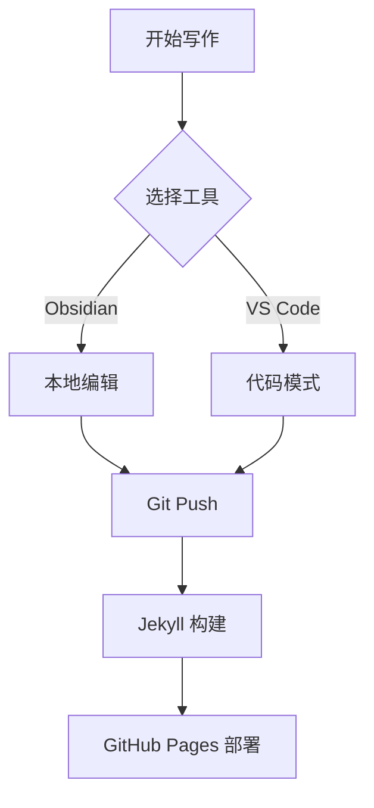
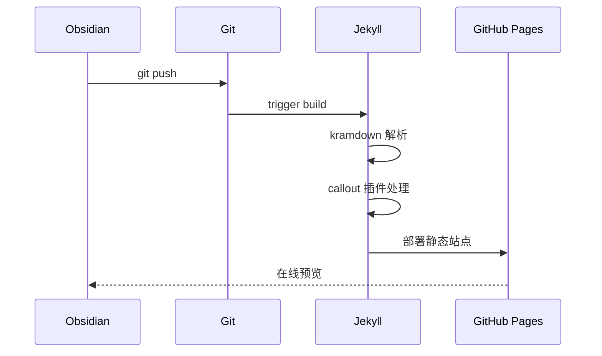

这篇文章演示了从 Obsidian 无缝迁移到博客的所有富文本功能。

## 数学公式 (KaTeX)

行内公式：欧拉公式 $e^{i\pi} + 1 = 0$ 是数学中最美的等式之一。

块级公式——贝叶斯定理：

$$P(A|B) = \frac{P(B|A) \cdot P(A)}{P(B)}$$

更复杂的例子——傅里叶变换：

$$\hat{f}(\xi) = \int_{-\infty}^{\infty} f(x) e^{-2\pi i x \xi} \, dx$$

## 代码高亮 (highlight.js)

Python 示例：

```python
def fibonacci(n: int) -> list[int]:
    """Generate Fibonacci sequence."""
    fib = [0, 1]
    for i in range(2, n):
        fib.append(fib[i-1] + fib[i-2])
    return fib[:n]

print(fibonacci(10))
```

JavaScript 示例：

```javascript
const debounce = (fn, ms) => {
  let timer;
  return (...args) => {
    clearTimeout(timer);
    timer = setTimeout(() => fn(...args), ms);
  };
};
```

## Callouts (Obsidian 标注)

> [!note] 笔记
> 这是一个标准笔记 callout。在 Obsidian 中使用 `> [!note]` 语法编写。

> [!tip] 小技巧
> 使用 `$...$` 包裹行内数学，`$$...$$` 包裹块级数学。

> [!warning] 注意
> Callout 内也支持**粗体**、*斜体*和 `代码`。

> [!danger] 危险操作
> 请勿在生产环境直接执行 `rm -rf /`。

> [!example] 示例
> 这是一个 example 类型的 callout，适合展示代码片段或操作步骤。

> [!quote] 引用
> "The best way to predict the future is to invent it." — Alan Kay

> [!info] 信息
> 本博客基于 Jekyll + kramdown，支持 Obsidian 原生语法。

> [!success] 完成
> 所有功能已实现并通过测试。

> [!question] 问题
> 如何在 Obsidian 中使用 Mermaid 图表？直接用 ` ```mermaid ``` ` 代码块即可。

## 可折叠内容

> [!note]- 点击展开（默认折叠）
> 这段内容默认是折叠的，点击标题可以展开。

> [!tip]+ 点击折叠（默认展开）
> 这段内容默认是展开的，点击标题可以折叠。

## Mermaid 图表

流程图：



序列图：



## 双链 (Wikilinks)

在 Obsidian 中可以使用 `[[文件名]]` 创建双链。例如：

- [[2026-02-13-game-theory|博弈论]]
- [[2026-02-13-microeconomics|微观经济学笔记]]
- [[2026-02-13-supply-and-demand|供给与需求分析]]

## 表格

| 功能 | Obsidian 语法 | 博客支持 |
|------|-------------|---------|
| 数学公式 | `$...$` / `$$...$$` | KaTeX |
| 代码高亮 | ` ```lang ``` ` | highlight.js |
| 标注框 | `> [!type]` | Jekyll 插件 |
| 图表 | ` ```mermaid ``` ` | Mermaid.js |
| 双链 | `[[page]]` | jekyll-wikirefs |
| 折叠 | `> [!type]-` | details/summary |

## 脚注

这是一个带脚注的句子[^1]，还有另一个[^2]。

[^1]: 脚注内容会显示在页面底部。
[^2]: Jekyll 的 kramdown 原生支持脚注语法。
